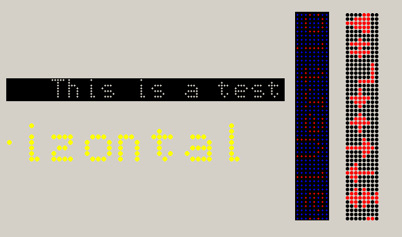



## LED Scrolling Marquee

### Description

Check it out! This scrolling marquee ActiveX example is able to display any character from ASCII 0 to 255 except for carrage return, line feed or tab. It can scroll horizontal or vertical. It has custom colors, LED sizes, LED spacing, and more.
 
### More Info
 

             |
---                |---
**Submitted On**   |2001-07-16 17:47:42
**By**             |[Jon Feucht](https://github.com/Planet-Source-Code/PSCIndex/blob/master/ByAuthor/jon-feucht.md)
**Level**          |Advanced
**User Rating**    |4.7 (33 globes from 7 users)
**Compatibility**  |VB 5\.0
**Category**       |[OLE/ COM/ DCOM/ Active\-X](https://github.com/Planet-Source-Code/PSCIndex/blob/master/ByCategory/ole-com-dcom-active-x__1-29.md)
**World**          |[Visual Basic](https://github.com/Planet-Source-Code/PSCIndex/blob/master/ByWorld/visual-basic.md)
**Archive File**   |[LED Scroll229137162001\.zip](https://github.com/Planet-Source-Code/jon-feucht-led-scrolling-marquee__1-25104/archive/master.zip)

